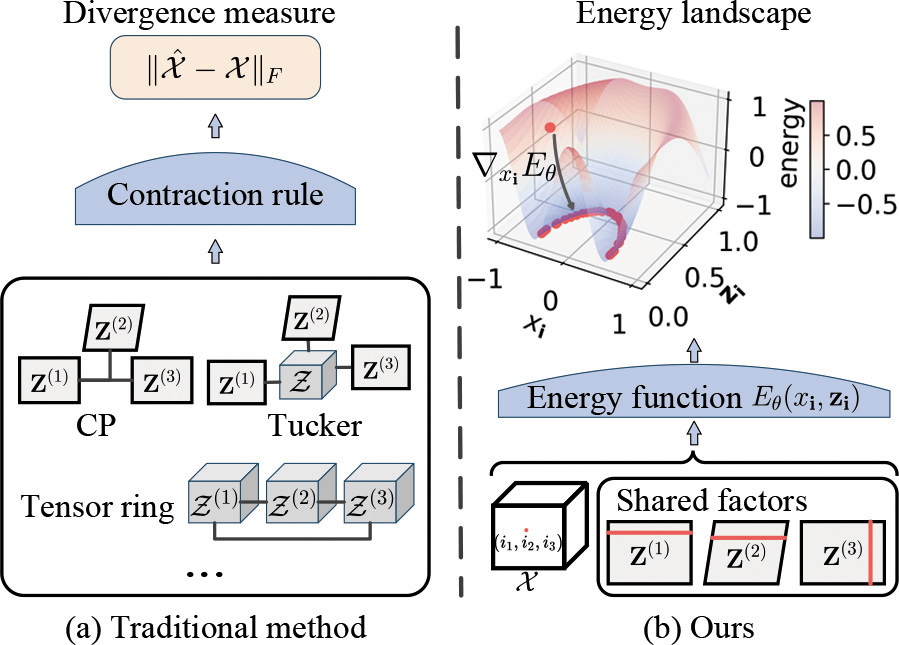

# Score-Based Model for Low-Rank Tensor Recovery

&nbsp;

## Overview

## Installation
1. Download source code and dataset:
    * `git clone https://github.com/CZY-Code/ScoreTR.git`
    * Download datasets
        - [Alog](https://github.com/xuangu-fang/Bayesian-streaming-sparse-tucker/tree/main/data/alog)
        - [Acc](https://github.com/xuangu-fang/Bayesian-streaming-sparse-tucker/tree/main/data/acc)
        - [Air](https://github.com/taozerui/energy_td/blob/main/dataset/beijing.npy)
        - [Click](https://github.com/wzhut/NONFAT/blob/master/data/clickthrough/ctr_50k.npy)
        - [Color Image](https://sipi.usc.edu/database/database.php)
        - [CAVE](https://www.cs.columbia.edu/CAVE/databases/multispectral/)
        - [Videos](http://trace.eas.asu.edu/yuv/)
   
2.  Pip install dependencies:
    * OS: Ubuntu 20.04.6
    * nvidia :
        - cuda: 12.1
        - cudnn: 8.5.0
    * python == 3.9.18
    * pytorch >= 2.1.0
    * Python packages: `pip install -r requirements.txt`

## Dataset Preparation
Unzip and move dataset into ROOT/data

### Directory structure of dataset          
        |- data      
        |   |- beijing.npy
        |   |- ctr_50k.npy
        |   |- acc
        |   |- alog       
        │   |- misc              
        │   |- MSIs
        |   |- Videos

## Train and Test
* run `./run_scoreTR.sh`
    
## Acknowledgement
This implementation is based on / inspired by:
* [EnergyTD](https://github.com/taozerui/energy_td)
* [reproducible-tensor-completion-state-of-the-art](https://github.com/zhaoxile/reproducible-tensor-completion-state-of-the-art)
* [M2DMT](https://github.com/jicongfan/Multi-Mode-Deep-Matrix-and-Tensor-Factorization)
* [HLRTF](https://github.com/YisiLuo/HLRTF)
* [Continuous-Tensor-Toolbox](https://github.com/YisiLuo/Continuous-Tensor-Toolbox)
* [DeepTensor](https://github.com/vishwa91/DeepTensor)